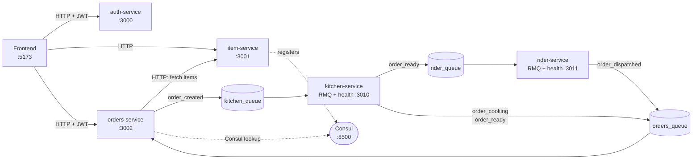

# SwiftBite

Full-stack food delivery platform. React storefront and admin panel on a NestJS
microservice backend. Orders flow through a real event pipeline: placed → cooked
→ dispatched, with one correlation ID tracing every order across all services.

## What is here

**Frontend** (React + Vite + Tailwind + Redux Toolkit + TanStack Query)
- Guest menu browsing with category tabs and client cart
- Login and register with full password rules, JWT in Redux plus localStorage
- Checkout with multi-line orders, order confirmation, and a floating cart bar
- Order history with status filter tabs and server-side pagination
- Order detail with live status polling and a progress timeline
- Cancel pending orders
- Admin panel: dashboard stats, category CRUD, item CRUD with image and availability
- Role gating (admin vs customer), shared profile menu, responsive layout

**Backend** (NestJS 11 microservices, one database each)
- auth-service: register, login, verify, JWT carrying roles
- item-service: categories and menu items, admin-guarded writes, decimal prices
- orders-service: multi-line orders with line-item snapshots, paginated list,
  event-driven status, pending-only cancellation
- kitchen-service: RMQ consumer creating tickets, simulating cooking, emitting events
- rider-service: RMQ consumer assigning riders and recording dispatches
- RabbitMQ event flow with a status queue that advances orders without sync calls
- Consul service discovery with healthy-instance filtering and static fallback
- End-to-end correlation IDs, Pino structured JSON logs, Swagger docs per service
- Graceful shutdown, liveness and readiness health checks

**Infrastructure** (Docker Compose)
- Five services plus RabbitMQ and Consul, one command to run
- pnpm workspace, Neon Postgres per service with separate roles and migrations
- Four seeded accounts: admin, kitchen, rider, customer

## Architecture



One `correlationId` rides every order from `POST /orders` through all three
databases and log streams — see [observability.md](./docs/observability.md).

Order status is event-driven: `pending` → `cooking` → `ready` → `dispatched`
via `orders_queue`, with user `cancelled` while pending. One checkout is one order
with its own line items — see [database-schema.md](./docs/database-schema.md).

## API docs (Swagger)

Each HTTP service serves interactive docs with bearer auth (Authorize button
takes a JWT from login):

| Service | Docs |
|---------|------|
| auth-service | http://localhost:3000/api |
| item-service | http://localhost:3001/api |
| orders-service | http://localhost:3002/api |

Key endpoints: `POST /auth/register`, `POST /auth/login`, `GET /categories`,
`GET /items`, `POST /orders` (lines array), `GET /orders?page=&limit=&status=`,
`GET /orders/:id`, `PATCH /orders/:id/cancel`.

## Services

| Service | Database | Transport | Port | Owns |
|---------|----------|-----------|------|------|
| [auth-service](./auth-service/README.md) | auth_db | HTTP | 3000 | Users, JWT |
| [item-service](./item-service/README.md) | item_db | HTTP | 3001 | Menu items, categories |
| [orders-service](./orders-service/README.md) | orders_db | HTTP + RMQ | 3002 | Orders |
| [kitchen-service](./kitchen-service/README.md) | kitchen_db | RMQ (health :3010) | — | Tickets |
| [rider-service](./rider-service/README.md) | rider_db | RMQ (health :3011) | — | Dispatches |
| [frontend](./frontend/README.md) | — | HTTP | 5173 | Storefront + admin UI |

## Documentation

| Doc | Description |
|-----|-------------|
| [Database Setup](./docs/database-setup.md) | Neon project, databases, roles, migrations |
| [Database Schema](./docs/database-schema.md) | Table definitions, columns, types, relationships |
| [Docker Setup](./docs/docker-setup.md) | Docker Compose, running all services, troubleshooting |
| [Test Setup](./docs/test-setup.md) | Test databases, .env.test, running tests |
| [API Collections](./docs/api-collections/) | Postman API collections |
| [API Docs (Swagger)](./docs/swagger.md) | Interactive docs, bearer auth flow |
| [Service Discovery](./docs/service-discovery.md) | Consul setup, registration, discovery |
| [Observability](./docs/observability.md) | JSON logging, correlation IDs, tracing an order |

## Quick Start

### Docker (recommended)

```bash
cd main
cp .env.example .env  # Fill in your database URLs
docker-compose up -d
```

See [docker-setup.md](./docs/docker-setup.md) for full instructions.

### Local development

1. Create databases and roles — see [database-setup.md](./docs/database-setup.md)
2. Configure `.env` for each service
3. Run migrations: `pnpm db:migrate`
4. Seed test users: `pnpm db:seed` (in `auth-service/`)
5. Start dev server: `pnpm start:dev`

Seeded logins (passwords pass the backend rule):

| Email | Password | Role |
|-------|----------|------|
| admin@swiftbite.local | Admin123! | admin |
| kitchen@swiftbite.local | Kitchen123! | kitchen |
| rider@swiftbite.local | Rider123! | rider |
| customer@swiftbite.local | Customer123! | customer |

### Frontend

```bash
cd main/frontend
cp .env.example .env
pnpm install
pnpm dev   # http://localhost:5173, API proxied to :3000/:3001/:3002
```

## Testing

```bash
cd item-service
pnpm test         # unit tests
pnpm test:e2e     # feature tests (needs test DBs)
```

See [test-setup.md](./docs/test-setup.md) for full instructions.
